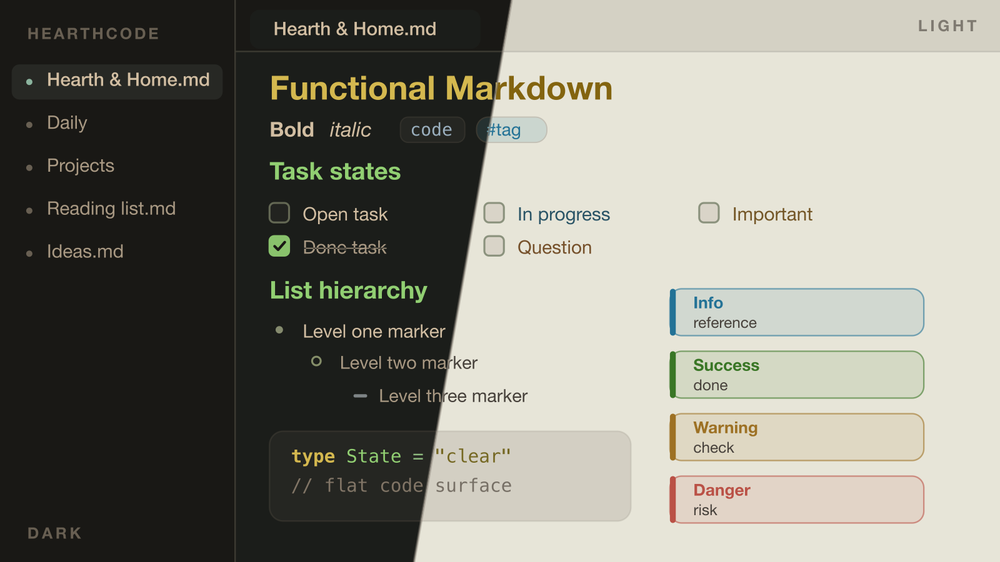

# HearthCode for Obsidian

Warm, calm dark and light themes for [Obsidian](https://obsidian.md), built from the HearthCode color system. The same color language applied to functional Markdown — typed callouts, task states, layered lists, flat code and quote surfaces, and tag pills, kept consistent across edit and reading views.

- **Modes:** Dark and Light
- **Homepage:** https://theme.hearthcode.dev

## Install

### From Obsidian (recommended)

1. Open **Settings → Appearance → Themes → Manage**.
2. Search for **HearthCode** and click **Install and use**.

### Manual

1. Download `manifest.json` and `theme.css` from this repository.
2. Copy them into `<your-vault>/.obsidian/themes/HearthCode/`.
3. In **Settings → Appearance → Themes**, select **HearthCode**.

## About this repository

This repo is the Obsidian **publish target** for HearthCode. Everything here
(`manifest.json`, `theme.css`, `versions.json`, `screenshot.png`, `hero.png`,
and this `README.md`) is generated and synced from the source-of-truth monorepo,
[hearth-code/HearthTheme](https://github.com/hearth-code/HearthTheme) — don't
edit it here. Please file issues and changes against that repository.

## License

[MIT](LICENSE)
